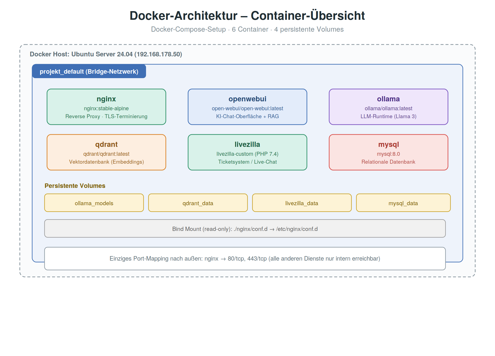
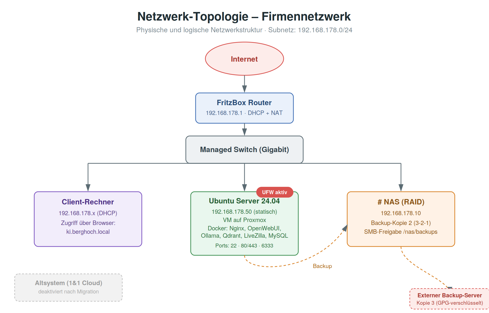
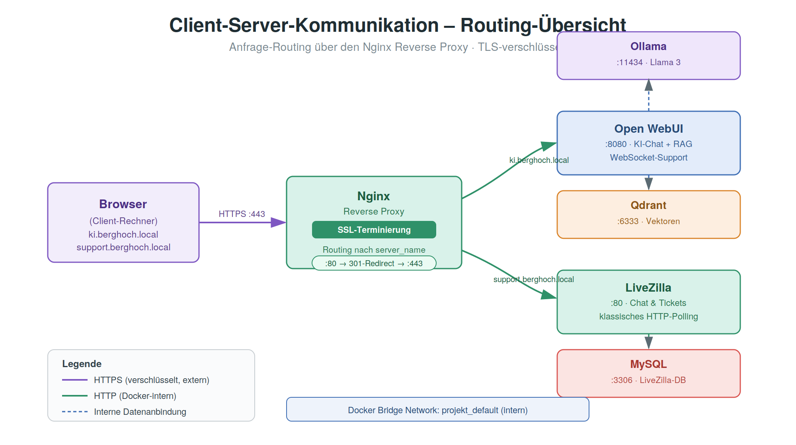
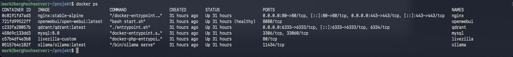
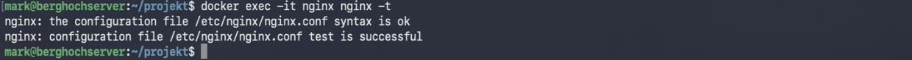
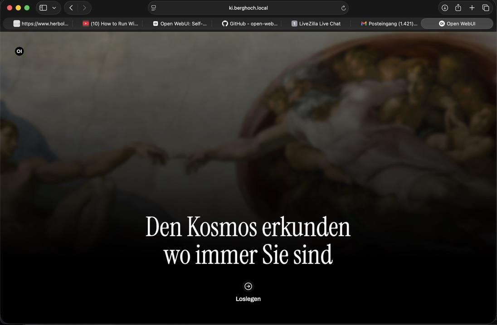
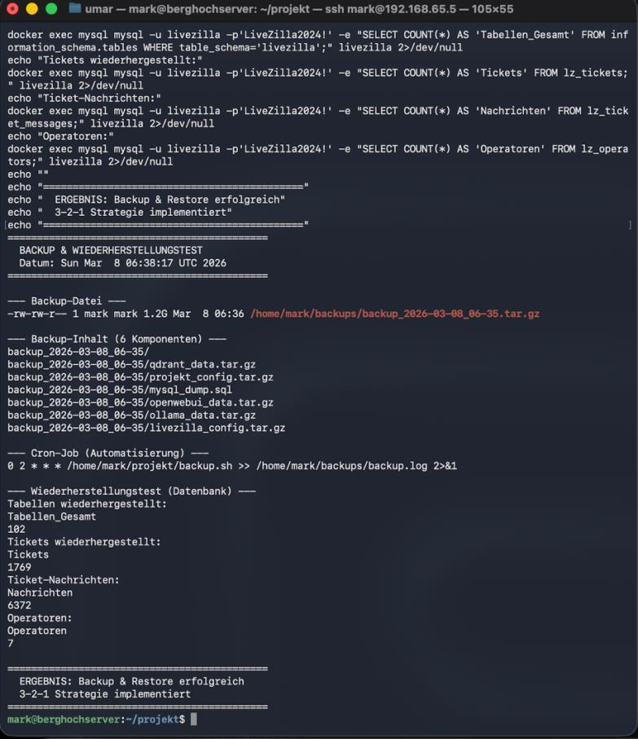

# 🎫 Ticketsystem-Migration mit KI-gestützter Wissensbasis (RAG)

Migration eines cloudbasierten Ticketsystems auf eine lokale, containerisierte
Infrastruktur – ergänzt durch ein KI-gestütztes Wissensmanagementsystem auf
Basis von Retrieval Augmented Generation (RAG).

> IHK-Abschlussprojekt | Fachinformatiker für Systemintegration (2026)

## 📌 Ausgangslage

Ein mittelständisches Unternehmen aus dem Bereich Sicherheitstechnik betrieb
sein Kunden-Support-Ticketsystem (LiveZilla) auf einem externen Cloud-Server.
Das führte zu mehreren Problemen:

- Volle Abhängigkeit vom Cloud-Anbieter, keine Kontrolle über Infrastruktur
- Kein Backup-/Recovery-Konzept
- Support-Wissen verteilt auf Handbücher, alte Tickets und PDFs — keine
  zentrale Wissensdatenbank
- Datenschutzrechtliche Fragen durch externe Datenverarbeitung (DSGVO/AVV)

## 🎯 Ziel des Projekts

- Migration des Ticketsystems auf einen lokalen, selbst verwalteten Server
- Aufbau einer lokalen KI-Wissensplattform (RAG) zur Unterstützung des Supports
- Verschlüsselte Erreichbarkeit aller Dienste (HTTPS)
- Automatisierte Backup-Strategie nach dem 3-2-1-Prinzip

## 🏗️ Architektur

Alle Dienste laufen containerisiert über Docker Compose in einem gemeinsamen
Bridge-Netzwerk. Nach außen ist ausschließlich der Reverse Proxy erreichbar –
alle anderen Dienste kommunizieren ausschließlich intern über Docker-Hostnamen.





**Komponenten:**

| Dienst | Rolle |
|---|---|
| **Nginx** | Reverse Proxy, TLS-Terminierung (TLS 1.2/1.3), einziger extern erreichbarer Dienst |
| **LiveZilla** (PHP 7.4, Custom Image) | Ticketsystem, läuft mit MySQL-Backend |
| **MySQL 8.0** | Relationale Datenbank für LiveZilla |
| **Ollama** | Lokale LLM-Runtime (Llama 3) |
| **Open WebUI** | Chat-Oberfläche mit nativer RAG-Anbindung |
| **Qdrant** | Vektordatenbank für semantische Suche (Embeddings) |

**Warum Container statt VMs?** Geringerer Ressourcenbedarf, zentrale
Konfiguration über eine einzige `docker-compose.yml`, hohe Reproduzierbarkeit
(gesamtes System auf neuem Host mit einem Befehl aufsetzbar).

## 🤖 Funktionsweise der KI-Wissensbasis (RAG)

1. Support-relevante Dokumente (Ticket-Historie, Handbücher, technische Docs)
   werden in Open WebUI hochgeladen
2. Dokumente werden automatisch in Chunks zerlegt und über
   `sentence-transformers/all-MiniLM-L6-v2` vektorisiert
3. Vektoren werden in Qdrant gespeichert
4. Bei einer Support-Anfrage wird die Frage ebenfalls vektorisiert, relevante
   Textabschnitte werden abgerufen und zusammen mit der Frage an Llama 3
   übergeben
5. Llama 3 generiert eine kontextbasierte, fertig formulierte Antwort

Ergebnis: Bearbeitungszeit pro Ticket sank in der internen Testphase von
durchschnittlich 25 Minuten auf 3–5 Minuten.

## 🔒 Sicherheitskonzept

- UFW-Firewall: nur Ports 22 (SSH), 80, 443 offen
- SSH ausschließlich per Key-Authentifizierung, Root-Login deaktiviert
- Alle internen Dienste (MySQL, Ollama, Qdrant) nicht von außen erreichbar
- TLS 1.2/1.3 über Nginx, veraltete Protokolle deaktiviert
- Nginx-Konfigurationsverzeichnisse read-only gemountet
- Backups verschlüsselt (AES-256) auf externem Speicherort

## 💾 Backup-Strategie (3-2-1)

Automatisiertes Backup-Skript (täglich via Cron):
- MySQL-Dump (`mysqldump --single-transaction`)
- Docker-Volumes (Qdrant, Open WebUI, Ollama) über temporäre Alpine-Container
- Konfigurationsdateien (docker-compose.yml, Nginx-Config)
- 3 Kopien: lokale Platte, NAS (SMB), externer Server (GPG-verschlüsselt)
- Automatische Löschung von Backups älter als 30 Tage
- Restore erfolgreich getestet (vollständige Wiederherstellung aller Tabellen)

## 📊 Ergebnis

| Kriterium | Ergebnis |
|---|---|
| Datenmigration | 100 % (alle Tabellen vollständig migriert) |
| Verschlüsselung | Durchgängig TLS 1.3 |
| Reduktion Bearbeitungszeit pro Ticket | ca. 60–80 % |
| Backup-Automatisierung | Täglich, Restore getestet |
| Tests bestanden | 12 / 12 |

## 🖼️ Screenshots

| | |
|---|---|
|  Container-Status |  Nginx-Konfigurationstest |
|  Open WebUI mit Llama 3 |  Backup & Restore |

## 🛠️ Tech Stack

`Docker` `Docker Compose` `Nginx` `Ollama` `Llama 3` `Qdrant` `Open WebUI`
`MySQL` `PHP` `Ubuntu Server 24.04 LTS` `UFW` `SSH`

## 🐳 Docker-Setup

Die komplette Infrastruktur wird über eine einzige `docker-compose.yml` verwaltet.
Zugangsdaten werden nicht im Klartext hinterlegt, sondern über Umgebungsvariablen
(`.env`-Datei) eingebunden.

**[→ docker-compose.yml ansehen](docker/docker-compose.yml)**
**[→ Dockerfile-livezilla ansehen](docker/Dockerfile-livezilla)**

```yaml
services:
  nginx:
    image: nginx:stable-alpine
    ports:
      - "80:80"
      - "443:443"
    depends_on:
      - openwebui
      - livezilla

  mysql:
    image: mysql:8.0
    environment:
      - MYSQL_ROOT_PASSWORD=${DB_ROOT_PASSWORD}
      - MYSQL_DATABASE=livezilla
      - MYSQL_USER=livezilla
      - MYSQL_PASSWORD=${DB_USER_PASSWORD}
    volumes:
      - mysql_data:/var/lib/mysql

# vollständige Version inkl. Ollama, Qdrant, Open WebUI, LiveZilla
# und Netzwerk-Konfiguration siehe docker/docker-compose.yml
```

LiveZilla benötigt PHP 7.4 mit GD- und MySQLi-Erweiterung, die im
offiziellen PHP-Image fehlen – dafür ein eigenes Image:

```dockerfile
FROM php:7.4-apache

RUN apt-get update && apt-get install -y \
    libpng-dev libjpeg-dev libfreetype6-dev \
    && docker-php-ext-configure gd --with-freetype --with-jpeg \
    && docker-php-ext-install gd mysqli

EXPOSE 80
```

**Setup:**
```bash
git clone <repo-url>
cd docker
cp .env.example .env   
docker compose up -d
```


## 📁 Repo-Struktur

- [`diagrams/`](diagrams/) → Architektur- & Netzwerkdiagramme
- [`docker/`](docker/) → docker-compose.yml, Dockerfile, .env.example (bereinigt)
- [`screenshots/`](screenshots/) → Screenshots der Durchführung
- [`README.md`](README.md) → Diese Übersicht

---

*Aus Datenschutzgründen wurden Firmenname sowie sämtliche Zugangsdaten,
Passwörter und interne Geschäftszahlen aus diesem Repository entfernt bzw.
anonymisiert.*
